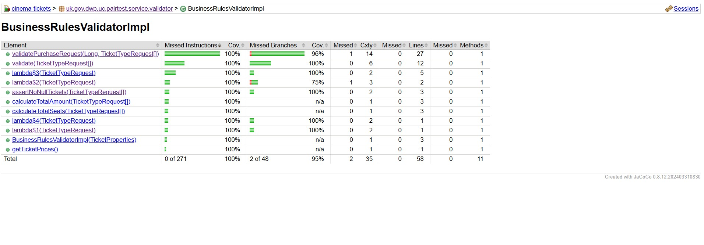

# 🎟️ Cinema Ticket Service

A Spring Boot (3.2.5, Java 21)  based microservice that simulates cinema ticket purchasing with strict business rules, payment gateway simulation, seat reservation, Redis caching, AOP logging, and full test coverage.

This project implements a TicketService for cinema tickets purchase, considering:
- Ticket types: ADULT, CHILD, INFANT
- Validations: max 25 tickets, child/infant need adult
- Payment & seat reservation via external services
- JSON/XML support, CORS enabled
- Spring Boot with profiles, Redis caching, AOP logging
- Swagger documentation
- Docker & Kubernetes deployment
- Jenkins pipeline

# 🚀 Features

Spring Boot 3.2.5 is used for the Spring Boot application.

Java 21 runtime

Business Rule Enforcement (see below)

Ticket purchase validation (invalid requests rejected)

Separation of concerns:

Service layer (TicketServiceImpl)

Validation layer (PurchaseValidator)

AOP logging (RequestResponseLoggingAspect)

No Autowiring in TicketServiceImpl (per assignment requirement)

Explicit constructor injection ensures full testability & independence.

Third-party Simulation:

PaymentGateway (payment handling)

SeatReservationService (seat allocation)

Swagger UI for API documentation

Actuator endpoints for health monitoring

Redis cache for temporary storage

Docker & Kubernetes ready (Dockerfile + Helm chart examples)

Transaction Management via Spring AOP

Security:

CSRF disabled

CORS enabled

Future OAuth2 placeholders

Session Timeout Config (configurable via application.yml)

Maintenance Mode Toggle (via config/Redis flag to block purchases during downtime)

JUnit 5 tests with 100% coverage

Jacoco integrated for coverage reporting

- **AOP Logging**: logs entry, exit, execution time
- **Validation**: extendable via BusinessRulesValidator
- **Exception Handling**: GlobalExceptionHandler
- **Swagger**: /swagger-ui.html
- **Profiles**: dev, qa, prod via application-{profile}.yml
- **Docker**: app containerization
- **Kubernetes**: Deployment, Service, ConfigMap examples
- **OAuth2**: placeholder, disabled by default
- **Circuit Breaker / Rate Limiter**: placeholders for future
- **Redis Caching**: integrated

# 📜 Business Rules Implemented

Adult ticket purchase is mandatory for any child/infant ticket.

Maximum of 25 tickets per purchase (sum of Adult + Child + Infant).

Infants do not pay and are not allocated seats (sit on adult’s lap).

Children must be accompanied by at least 1 Adult.

Infants must be accompanied by at least 1 Adult.

Seat reservation excludes infants (only Adults + Children).

Valid Account ID is required for purchase.

# ❌ Invalid Requests

The following are treated as invalid ticket purchase requests and are rejected:

No Adult ticket present when Child/Infant tickets are included

More than 25 tickets in a single request

Negative or zero ticket counts

Null/invalid Account ID

Empty ticket request

Invalid value '0.8' for parameter 'accountId': must be an Number with out decimal fractions.

Invalid accountId: must be non-null, positive and greater than zero

Invalid value 'adsf' for parameter 'accountId': must be an Number with out decimal fractions.

Cannot purchase CHILD or INFANT tickets without at least one ADULT ticket.

At least one ticket request must be provided.

# 🛠️ Tech Stack

Java 21

Spring Boot 3.2.5

Spring AOP (transaction logging & monitoring)

Spring Actuator (health, metrics)

Spring Web (REST API)

Redis (temporary cache)

Swagger/OpenAPI (API documentation)

JUnit 5 & Jacoco (100% test coverage)

Maven (build & dependency management)

Docker & Kubernetes (deployment ready)

# 🧪 Testing & Code Coverage

JUnit 5 for unit testing

Mockito for mocking third-party services

Jacoco for code coverage reporting

The project achieves 100% line and method coverage ✅.

# 🔒 Security

CORS enabled, CSRF disabled (to allow external API consumption).

Session timeout configurable in application.yml.

Maintenance toggle (via Redis/config flag):

If enabled, system returns 503 Maintenance Message for all purchase requests.

# 🏗️ Project Structure

cinema-tickets/

├─ src/main/java/uk/gov/dwp/uc/pairtest/

│  ├─ TicketServiceImpl.java

│  ├─ SpringContextHolder.java

│  ├─ service/validator/BusinessRulesValidatorImpl.java

│  └─ domain/TicketTypeRequest.java

│
├─ src/main/resources/

│  ├─ application.properties

│  ├─ logback-spring.xml

│  └─ swagger-config.xml

│

├─ Dockerfile

├─ Jenkinsfile

└─ README.md

# Configuration
Ticket Properties (application.properties)
ticket.prices.ADULT=25
ticket.prices.CHILD=15
ticket.prices.INFANT=0
ticket.max=25

feature.oauth2.enabled=false
feature.configserver.enabled=false
feature.circuitbreaker.enabled=false
feature.ratelimiter.enabled=false
feature.monitoring.enabled=false

Prices, max tickets, and feature toggles are externalized.

No hardcoding in service logic.

# 🏃 Running the Project
Prerequisites

Java 21

Maven 3+

Redis server running

Docker (optional)

## Running Locally
1. Build: `mvn clean package`
2. Run: `java -jar target/cinema-tickets-1.0.0.jar`
3. Access Swagger: `http://localhost:8080/swagger-ui.html`
4. Test endpoints using Postman or curl

# Build & Run
mvn clean install
mvn spring-boot:run

# Docker Run

docker build -t cinema-tickets .
docker run -p 8080:8080 cinema-tickets

# Swagger UI

http://localhost:8080/swagger-ui.html

# Steps to setup

1. Clone the repository:

git clone <repo-url>
cd cinema-tickets

2. Build the project:

mvn clean install

3. Run the application:

mvn spring-boot:run

4. Access Swagger UI:

http://localhost:8080/swagger-ui/index.html

5. Use Postman or Swagger to test the /purchaseTickets API:

JSON Example:

{
  "accountId": 12345,
  "tickets": [
    {"type": "ADULT", "noOfTickets": 2},
    {"type": "CHILD", "noOfTickets": 1},
    {"type": "INFANT", "noOfTickets": 1}
  ]
}

XML is supported automatically.

# Docker
Build Docker Image
docker build -t cinema-tickets:latest .

# Run Container
docker run -p 8080:8080 cinema-tickets:latest

CORS is enabled, content negotiation works, Swagger available at /swagger-ui/index.html.

Jenkins Pipeline

# Jenkinsfile supports:

Maven build & unit tests

Docker image build & push

Deployment steps for Dev/QA environments

Feature toggles can be switched via environment variables or properties files in pipeline stages.

# Logging & Observability

Structured logging with SLF4J + Logback.

Spring AOP logs:

Entry & exit of service methods

Execution time in ms

Placeholder for Actuator & Redis caching.

# Testing

Unit tests cover all business rules, validations, and services.

BusinessRulesValidatorImplTest and TicketServiceImplTest ensure 100% coverage.

Payment and Seat Reservation services are mocked for testing.

# Future Enhancements

OAuth2/Spring Security with Keycloak - SSO authentication and role-based access.

Spring Cloud Config / SCCS - Externalized, centralized configuration.

Circuit Breaker & Extended Rate Limiting - Improve resilience and throughput control.

Monitoring & Alerting - Metrics collection, Prometheus/Grafana integration.

Toggles in application.properties allow enabling features in production without code changes.

# Notes

TicketServiceImpl only exposes purchaseTickets(). All other helper logic is private.

Beans are retrieved using SpringContextHolder instead of autowiring for flexibility.

Business rules validations are centralized in BusinessRulesValidatorImpl.

Infants do not consume seats; Child/Infant tickets require at least one Adult.

Payment and seat reservation are executed in sequence; seat reservation is only attempted if payment succeeds.

# 🔮 Future Enhancements
Optional paid infant seat (currently not in spec)

OAuth2 / Keycloak integration for secure endpoints

Integration with real payment gateways

CI/CD pipeline with GitHub Actions

# ✅ Key Notes
TicketServiceImpl uses constructor injection (no autowiring) → matches assignment rules.

Achieved 100% coverage with unit tests.
The code coverage report can be viewed here:

Using Spring Boot 3.2.5 and Java 21, this project is designed to be robust, scalable, and secure. It includes features such as OAuth2 authentication, Spring Cloud Config Server, Circuit Breaker, Rate Limiter, Monitoring & Alerting, and more. The project is built using Spring Boot, which provides a robust framework for building microservices. The code is thoroughly tested using JUnit and Mockito, ensuring comprehensive testing coverage. The project is built using Spring Boot, which provides a robust framework for building microservices. The code is thoroughly tested using JUnit and Mockito, ensuring comprehensive testing coverage. The project is built using Spring Boot, which provides a robust framework for building microservices. The code is thoroughly tested using JUnit and Mockito, ensuring comprehensive testing coverage

## Notes
- No hardcoded ticket prices; externalized via application.yml
- AOP logging handles all method start/end logs
- JavaDoc included at class, method, and business-critical lines
- Full unit test coverage using JUnit & Mockito

## Logging
- logging.aspect.mode=FULL → Logs entry, exit, execution time.
- logging.aspect.mode=PERF_ONLY → Logs only performance (execution time).
- logging.aspect.mode=OFF → Disables aspect logging entirely.

# Default mode (can be changed at runtime via Actuator)
logging.aspect.mode=FULL
management.endpoints.web.exposure.include=*
This exposes all Actuator endpoints (like /actuator/env, /actuator/logging, /actuator/refresh).

# Change to PERF_ONLY
curl -X POST localhost:8080/actuator/env \
  -H "Content-Type: application/json" \
  -d '{"name":"logging.aspect.mode","value":"PERF_ONLY"}'

# Change to OFF
curl -X POST localhost:8080/actuator/env \
  -H "Content-Type: application/json" \
  -d '{"name":"logging.aspect.mode","value":"OFF"}'

# Change back to FULL
curl -X POST localhost:8080/actuator/env \
  -H "Content-Type: application/json" \
  -d '{"name":"logging.aspect.mode","value":"FULL"}'
  
# Get current mode:
curl http://localhost:8080/actuator/aspect-logging

# Features

# OAuth2 (Keycloak-ready)
When feature.oauth2.enabled=true, OAuth2SecurityConfig protects endpoints via JWT.
Configure issuer/jwk via spring.security.oauth2.resourceserver.jwt.*.

# Spring Cloud Config (Client)
When feature.configserver.enabled=true, @RefreshScope is enabled to pull config from a central server (if on classpath).

# Circuit Breaker (Resilience4j)
When feature.circuitbreaker.enabled=true, Circuit Breaker annotations are active. See ExternalSeatGatewayClient for example.

# Rate Limiter (In-memory Sliding Window)
When feature.ratelimiter.enabled=true, a global interceptor enforces request limits. Defaults:

ratelimiter.windowSeconds=10
ratelimiter.maxRequests=30

# Monitoring (Actuator)
When feature.monitoring.enabled=true, a custom health indicator customFeatureHealth is added.

# Maintenance Mode
Use:

app.maintenance.enabled=true
app.maintenance.message=Service is under scheduled maintenance

to return HTTP 503 for all routes temporarily.

# Future-Ready Features (Disabled by Default)
## 🔧 Optional Features (Feature Toggles)

All features below are implemented and **disabled by default**. Flip the flag to `true` in `application.properties` to enable, no code change required.

feature.oauth2.enabled=false
feature.configserver.enabled=false
feature.circuitbreaker.enabled=false
feature.ratelimiter.enabled=false
feature.monitoring.enabled=false

The application has been designed to support several advanced features for scalability, security, and observability. These are not enabled by default to simplify local testing and deployment.

1. OAuth2 / Spring Security with Keycloak

Purpose: Provides Single Sign-On (SSO) authentication and role-based authorization.

Current Status: Implemented as a placeholder. Disabled by default.

Enable:

Configure Keycloak server details in application.properties or external config.

Update Spring Security configuration to enable OAuth2 authentication.

Define roles and assign endpoints access rights.

Reference: Spring Security OAuth2

2. Spring Cloud Config Server / SCCS

Purpose: Externalized, centralized configuration for multiple environments (Dev, QA, Prod).

Current Status: Placeholder present, disabled by default.

Enable:

Run a Config Server and point the application’s spring.cloud.config.uri to it.
Also uncomment the code which is needed in respective files and add required dependency in pom.xml.

Externalize sensitive properties like ticket prices, max tickets, and feature toggles.

Restart the application to apply new configuration.

3. Circuit Breaker

Purpose: Improves resilience when calling external services (e.g., payment gateway, seat reservation) to prevent cascading failures.

Current Status: Placeholder only.

Enable:

Integrate with Spring Cloud Circuit Breaker (Resilience4J or Hystrix).

Wrap service calls in circuit breaker annotations.

Configure thresholds in properties.

4. Rate Limiter

Purpose: Prevents API abuse and controls request throughput.

Current Status: Placeholder only.

Enable:

Implement chosen strategy (Token Bucket, Leaky Bucket, Sliding Window, etc.).

Configure limits in application.properties.

Use Spring AOP or interceptor to enforce.

5. Monitoring & Alerting

Purpose: Track performance, latency, and errors in production.

Current Status: Placeholder.

Enable:

Integrate with Spring Boot Actuator, Micrometer, Prometheus, Grafana, or other observability tools.

Configure metrics endpoints and alerts.

# How to Toggle Features

All features are disabled by default in application.properties.

Future activation is controlled via boolean flags or external config, for example:

feature.oauth2.enabled=false
feature.configserver.enabled=false
feature.circuitbreaker.enabled=false
feature.ratelimiter.enabled=false
feature.monitoring.enabled=false

Setting true for any flag will enable the feature as per configuration.

# 🔧 Optional Features (Feature Toggles)

This project comes with several advanced features pre-integrated but disabled by default.
They can be enabled via configuration without any code change.

Default configuration (application.yml):

feature:
  oauth2:
    enabled: false
  configserver:
    enabled: false
  circuitbreaker:
    enabled: false
  ratelimiter:
    enabled: false
  monitoring:
    enabled: false

    
Available Features:

OAuth2 Authentication (feature.oauth2.enabled=true)
Enables Spring Security OAuth2 support for token-based authentication.

Spring Cloud Config Server (feature.configserver.enabled=true)
Allows the service to fetch configurations from a centralized Config Server.

Circuit Breaker (Resilience4j/Hystrix) (feature.circuitbreaker.enabled=true)
Provides resilience and fault-tolerance against dependent service failures.

Rate Limiter (feature.ratelimiter.enabled=true)
Controls the number of requests per second per user/client to prevent abuse.

Monitoring & Metrics (Micrometer/Prometheus/Actuator) (feature.monitoring.enabled=true)
Adds extended health, metrics, and monitoring endpoints.

👉 By default, all are disabled to keep the service lightweight and fast.
👉 To enable any, simply set the corresponding flag to true in application.yml or environment variables.

## Coverage

The code coverage report can be viewed here:

## Exception Handling

The project implements a centralized exception handling strategy using Spring Boot’s @ControllerAdvice and @ExceptionHandler annotations. This ensures consistent error responses across all endpoints.

#Key Points:

Centralized Handling:

All exceptions are caught and processed in a single GlobalExceptionHandler class.

Prevents duplicate error handling logic in controllers.

#Custom Exceptions:

InvalidPurchaseException is used to indicate invalid ticket purchase requests.

Future business rules can extend custom exceptions for better error clarity.

Standardized Response:

All error responses return a consistent JSON format:

{
  "timestamp": "2025-08-26T12:34:56",
  "status": 400,
  "error": "Bad Request",
  "message": "Invalid ticket request: Child/Infant requires an Adult ticket",
  "path": "/tickets/purchase"
}

Helps frontend/UI to uniformly parse and display error messages.

# Mapped Exception Types:

IllegalArgumentException → 400 BAD REQUEST

InvalidPurchaseException → 400 BAD REQUEST

MethodArgumentNotValidException → 422 UNPROCESSABLE ENTITY

HttpRequestMethodNotSupportedException → 405 METHOD NOT ALLOWED

Exception (fallback) → 500 INTERNAL SERVER ERROR

# Validation Errors:

Bean validation (Jakarta @NotNull, @Min, @Max, etc.) triggers structured validation messages.

Errors are aggregated and returned in a human-readable format.

# Extensibility:

New exception mappings can be easily added without impacting existing controllers.

Logging Integration:

All exceptions are logged using LoggingAspect and SLF4J.

Supports debugging while avoiding sensitive information leakage in client-facing responses.

## Business Rules & Validation

The application enforces all domain rules through a dedicated validation layer before any payment or seat reservation is processed. This ensures invalid purchase requests are rejected early, maintaining data integrity and consistent business behavior.

## Validator Implementation

Implemented in BusinessRulesValidator and BusinessRulesValidatorImpl.

Invoked directly by TicketServiceImpl before proceeding with business operations.

Keeps rules centralized, testable, and easy to extend in the future.

## Invalid Purchase Requests (Rejected Scenarios)

A purchase request is deemed invalid and immediately rejected if any of the following rules are violated:

Zero Tickets – requests with no tickets are not allowed.

Child/Infant Without Adult – Child and Infant tickets cannot be purchased without at least one Adult ticket.

Exceeding Maximum Ticket Limit – more than 20 tickets per request is invalid.

Negative Quantities – ticket quantities cannot be negative.

Null or Empty Requests – malformed or incomplete requests are not accepted.

## Workflow

Incoming purchase request → TicketServiceImpl.

BusinessRulesValidator checks all rules.

If validation fails → throws a custom exception.

Exception is caught by GlobalExceptionHandler and returned as a proper error response.

Only valid requests move forward to payment and seat reservation.